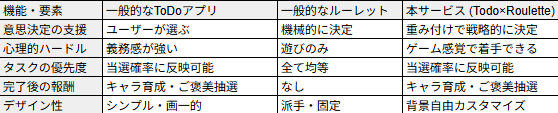

# todo-roulette

## サービス概要
どんなサービスなのかを３行で説明してください。

「何からやるか」の迷いをゼロにする、意思決定自動化ToDoアプリ。
タスクを登録するだけでルーレットが生成され、優先度に応じた確率で「今すぐやるべきこと」を決定。
タスク完了でキャラが進化する育成要素やご褒美設定により、作業を「義務」から「ゲーム」に変える。

## このサービスへの思い・作りたい理由
このサービスの題材となるものに関してのエピソードがあれば詳しく教えてください。
このサービスを思いつくにあたって元となる思いがあれば詳しく教えてください。

私は仕事や私生活においても優柔不断なところがあります。
仕事において言えば、顧客満足度調査、顧客メール回答、打ち合わせ用3D図面整理(印刷作業含める)、出荷業務、見積書の作成の5つの仕事をしないといけないときに
何から進めるか5分10分ほど迷ってしまい、隣にいた先輩に「何してんの？」と怒られてしまいました。
1個の作業を終えても次は何の作業を行おうかとまた迷う時間が発生してしまい合計30分ほどの時間を無駄にしてしまいました。
また私生活においては買い物をするとき予算内にするため服を4着中3着に決めないといけないのですが決めるのに30分ほどかかってしまい友達を待たせてしまいました。
このように作業しないといけないタスクが多くある場合何から作業すればよいのか判断できない(決めるのに時間がかかる)ことがあります。
この現象を調べてみると選択肢が多いがゆえに脳がフリーズしてしまう「決定回避」という現象から来ているそうです。
上記の時間の無駄をなくそうと考えたときにルーレットのアプリとTodoリストのアプリを使用してみましたがルーレットのアプリではそれぞれのタスクの優先度を決定できなく、Todoリストのアプリでは最終的に自分がタスクの順番を決定しないといけないです。
この両方のデメリットがないアプリがあればいいなと考えこのアプリを発案しました。

## ユーザー層について
決めたユーザー層についてどうしてその層を対象にしたのかそれぞれ理由を教えてください。

ユーザー層は10代後半〜30代の「タイムパフォーマンス」を重視する若年層を対象としてます。
対象にした理由は学生や仕事をしている方が多く、受験勉強、部活、マルチタスクを強いられる若手社会人など、1日のタスク密度が高い層ほど、迷う時間の損失が大きいため本ターゲット層にしました。
また、育成要素や背景カスタマイズなど、単なるツールを超えた「ゲーミフィケーション」の仕組みを楽しみながら継続できる層であるため需要が高いのではと考えております。

## ユーザーの獲得について
想定したユーザー層に対してそれぞれどのようにサービスを届けるのか現状考えていることがあれば教えてください。

1.優柔不断な友達に本アプリを利用してもらい広めていただく。
2.「優柔不断すぎて仕事が進まない人の末路」といった共感系ショート動画（TikTok/Reels）で上げて拡散する。

## サービスの差別化ポイント・推しポイント
似たようなサービスが存在する場合、そのサービスとの明確な差別化ポイントとその差別化ポイントのどこが優れているのか教えてください。
独自性の強いサービスの場合、このサービスの推しとなるポイントを教えてください。

(推しポイント)　ゲーミフィケーションによる「着手ハードル」の低下
「仕事＝苦痛」という認識を、育成要素（卵→恐竜への進化）によって「タスク完了＝キャラの餌やり・経験値」へと変換します。
現時点では仕事のタスクが多い場合はスーツを着た恐竜に進化させようと考えております。トレーニングが多い場合はマッチョな恐竜など、、、
このように進化ルートに分岐を設けることで、「次はどの姿になるのか見たい」という継続利用への強力な動機付けを行います。

(差別化ポイント)　迷う時間を物理的に排除するアルゴリズム
一般的なToDoアプリは「どれからやるか」を結局ユーザーが選ばなければなりませんが、本アプリはルーレットがその決断を代行します。
さらに、「優先度に応じた面積（当選確率）の変化」を実装することで、重要な仕事ほど当たりやすく、かつ「何が当たるかわからないワクワク感」を両立させています。

下記競合サービス比較表です。

## 機能候補
現状作ろうと思っている機能、案段階の機能をしっかりと固まっていなくても構わないのでMVPリリース時に作っていたいもの、本リリースまでに作っていたいものをそれぞれ分けて教えてください。

【MVPリリース】
1. リスト作成欄（開始ボタン設置含む）
イメージ: RailsのScaffoldをベースに、入力フォームと「ルーレット開始！」ボタンを配置。
技術: Turbo Frames を使うと、ページ全体をリロードせずにタスクの追加・削除ができ、サクサク動くUIになる。

2. ルーレット自動生成（デザイン含む）
イメージ: 入力されたタスクを円グラフのように分割して表示。
技術: Winwheel.js などのJSライブラリを使うか、CSSの conic-gradient をタスク数に合わせて動的に生成すると、デザイン性が高いルーレットが作れる。

3. 優先度による重み付け
イメージ: 「高・中・低」で選んだ優先度に応じて、ルーレットの面積（当選確率）が変わる。
技術: Ruby側で重み付け計算ロジック（例：高=3票, 中=2票, 低=1票）を書き、その比率をJSに渡してルーレットの描画角度を決定する。

4. ご褒美設定
イメージ: 「タスク完了時に出現する宝箱」の中身を自分で設定。
技術: rewards テーブルを作成し、タスク完了フラグが立った際にランダムで一つのレコードを表示する。

【本リリース】
5. 背景の自由性
イメージ: ユーザーが好きな背景画像やテーマカラー（ダークモード等）を設定。
技術: Userモデルに background_color 等のカラムを追加し、CSS変数（Custom Properties）を使って画面全体のスタイルを動的に変更する。

6. 育成要素（進化分岐ルート含む）
イメージ: 完了したタスクの「カテゴリー」によって進化先が分岐。
技術:
例：Category.where(name: "勉強").count が多ければ「知的な恐竜」へ。
Rubyの service object（ビジネスロジックを切り出したクラス）を作り、進化判定ロジックをカプセル化するとコードが綺麗になる。

7. 進化図鑑（コレクション機能）: 一度進化したキャラを一覧で見れるページ。
イメージ：進化が発生した瞬間に、そのキャラクターのIDをユーザーのコレクションに保存します。
技術：Active Storage キャラクター画像を管理、多対多の関連付け User と Character の間に Collections（中間テーブル）を作成する。

8. ダッシュボード（統計）: カテゴリー別の完了率を Chartkick でグラフ表示。
イメージ：<%= pie_chart Task.group(:category).count %> のような短いコードで、カテゴリー別のタスク分布を円グラフ化できる。
技術：Chartkick Rubyで簡単にグラフを描画できる定番ライブラリ。Groupdate 日別やカテゴリー別の集計を簡単にするGem。

9. 効果音・演出: ルーレット回転時や進化時のサウンド（JSで制御）。
イメージ：ルーレットが回っている間は「カチカチ」という音を、当たった瞬間に「ファンファーレ」を鳴らします。
技術：JavaScript (Howler.js)　音声再生を制御する軽量ライブラリ。ブラウザの再生制限なども扱いやすくなる。CSS Animations / Canvas Confetti　進化時の紙吹雪演出なども。

10. タスクの自動クリーンアップ: 古い完了済みタスクを定期的に整理するバッチ処理（Active Job）。
イメージ：「完了から30日以上経過したタスク」を毎日深夜に自動削除、あるいはアーカイブ化します。Task.where('completed_at < ?', 30.days.ago).destroy_all というスクリプトを定期実行するよ　　　　　　うに設定する。
技術：Active Job　バックグラウンドで処理を実行するRailsの機能。Sidekiq または Solid Queue　ジョブの実行管理。Whenever 定期実行（Cron）を設定するGem。

## 使用する技術スタック
一般的なCRUD以外の実装予定の機能についてそれぞれどのようなイメージで実装する予定なのか現状考えているもので良いので教えて下さい。
サービスを実装するための技術スタックについて、以下のような観点で記載してください。
- 使用するフレームワーク（例：使用するフレームワークのバージョン情報等）
- データベース（MySQL / PostgreSQLなど）
- デプロイ先（Heroku / Renderなど）
- 使用予定のライブラリ

フレームワーク：Ruby on Rails 7.1.x (Ruby 3.2.3) ： Hotwire（Turbo/Stimulus）を使えば、JavaScriptを大量に書かずにリアルタイムな画面更新（経験値アップ演出など）が可能なため使用。
データベース：PostgreSQL : Render.com や Heroku での標準であり、JSON形式のデータ保存も得意なため、進化ログなどの保存に便利なため使用。
デプロイ先：Render.com ： 無料枠があり、GitHubと連携して簡単にデプロイできるため使用。
主要ライブラリ：Devise ： ユーザー管理（ログイン機能）のデファクトスタンダードです。「自分のキャラ」を保存するために必須。

gemの追加:
ruby "3.2.3"
1. gem "devise" (ユーザー管理)
   役割: ログイン機能。ユーザーごとに「自分の恐竜」や「タスク」を紐付けて保存する。
   理由：ユーザーごとのデータ（育成データやタスク）の分離を安全かつ迅速に実現できるため。

2. gem "chartkick" & gem "groupdate" (統計・分析)
   役割: カテゴリー別のタスク完了率や、日々の頑張りをグラフで可視化する。
   理由: Rubyのコード1行でデータベースからグラフを生成でき、groupdate を併用することで「日別」「週別」といった時間の集計処理がSQLを直接書くより遥かに簡単になるため

3. gem "cloudinary" (画像ストレージ)
   役割: 進化したキャラクター画像をクラウドに保存。Renderの無料枠でも画像が消えないようにする。
   理由：外部ストレージに保存を任せることで、進化した恐竜などの画像データを永続的に保持でき、表示速度も高速化されるため。

4. gem "solid_queue" (非同期・定期処理)
   役割: 「完了から30日過ぎたタスクの自動削除」などのバックグラウンド処理を、追加のサーバーなしで実行する。
   理由：画面の裏側（バックグラウンド）で処理を分散実行でき、従来のライブラリ（Sidekiq）と違い追加のデータベース（Redis）が不要なため、無料のデプロイ環境でも管理が非常に楽なため。

5. gem "tailwindcss-rails"　(デザイン)
   役割: 恐竜の育成画面やルーレットのUIを、爆速でモダンなデザインに整えます。
   理由：ユーティリティクラス（p-4, flexなど）を組み合わせるだけで、HTMLファイル内から離れずに、レスポンシブかつオリジナルなデザインを直感的に構築できるため。

6. gem "font-awesome-sass", "~> 6.5.1" (アイコン)
   役割: タスクの優先度や、ご褒美メニューに使う視覚的なアイコンを提供する。
   理由：世界観に合う高品質なアイコンを即座に導入でき、視覚的に楽しい「ゲーム風のUI」を簡単に構築できるため。

7. gem "config"
   役割： APIキー（Cloudinaryなど）や「進化に必要な経験値」などの定数を、一箇所でまとめて管理できる設定ファイル（YAML）を提供する。
   理由：プログラムの中に「100ポイントで進化」と直接書くと後で修正が大変でこれを使えば設定ファイル一つで調整可能なため。

8. gem "kaminari"
   役割：タスクや図鑑の数が増えたときに、「1, 2, 3...」とページを分ける機能を提供する。
   理由：タスクが100個並ぶとルーレット画面が重くなるため、表示数を制限するため利用。

9. gem "active_storage_validations"
   役割：ユーザーがアップロードする背景画像などが「大きすぎないか」「画像形式（PNG/JPG）か」をチェックする。
   理由：巨大な画像がアップロードされるとCloudinaryの容量を圧迫したり、表示が遅くなるのを防ぐため。

## 画面推移図(Figma)URL
https://www.figma.com/design/16ThijvN2fkiSE5e0rxhz6/todo-roulette-%E7%94%BB%E9%9D%A2%E6%8E%A8%E7%A7%BB%E5%9B%B3%E3%80%80%E5%AE%8C%E6%88%90?node-id=0-1&t=EISN00abochioR3H-1

修正後のURL
https://www.figma.com/design/16ThijvN2fkiSE5e0rxhz6/todo-roulette-%E7%94%BB%E9%9D%A2%E6%8E%A8%E7%A7%BB%E5%9B%B3%E3%80%80%E5%AE%8C%E6%88%90?node-id=0-1&t=FCZ7ebY32GgfkzId-1

## ER図のURL
https://gyazo.com/b9a31315620767f8b07c5384d2040b12
